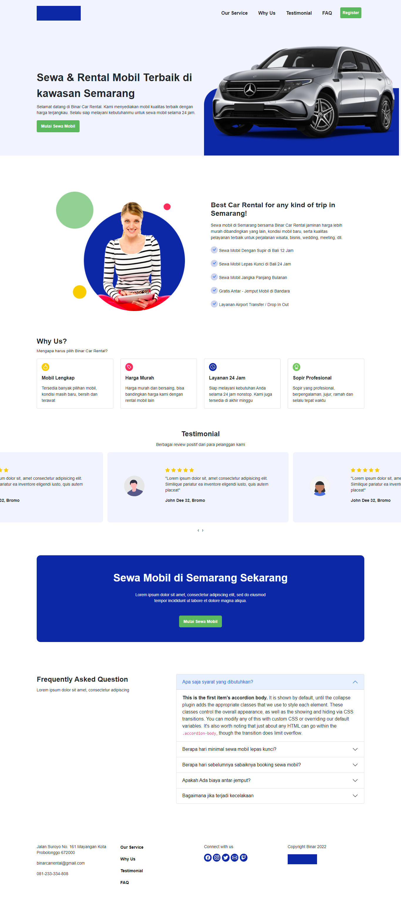
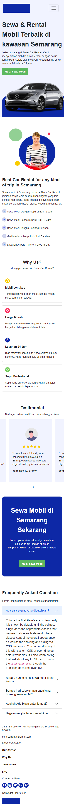
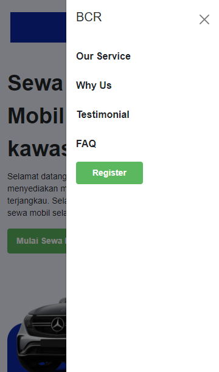

# Binar Learnings

Tempat untuk mengumpulkan latihan yang diberikan oleh mentor. Menggunakan Bootstrap versi 5 dan Owl Carousel.

Untuk lebih lengkapnya, baca dokumentasi link dibawah ini :

 - Bootstrap 5 `(https://getbootstrap.com/docs/5.1/getting-started/introduction/)`

 - Owl Carousel `(https://owlcarousel2.github.io/OwlCarousel2/docs/started-welcome.html)`

## Responsive Design

Responsive web design atau desain web responsif adalah sebuah teknik atau metode bagi web designer untuk membuat suatu layout website yang dapat menyesuaikan diri sesuai dengan ukuran layar pengguna.

## Tampilan Desktop

Berikut gambaran ketika layar berukuran desktop (>= 1200px)

## Tampilan Mobile

Berikut gambaran ketika layar berukuran mobile (>= 576px )

## Tampilan Mobile (SideBar)

Berikut gambaran ketika layar berukuran mobile (>= 576px )

