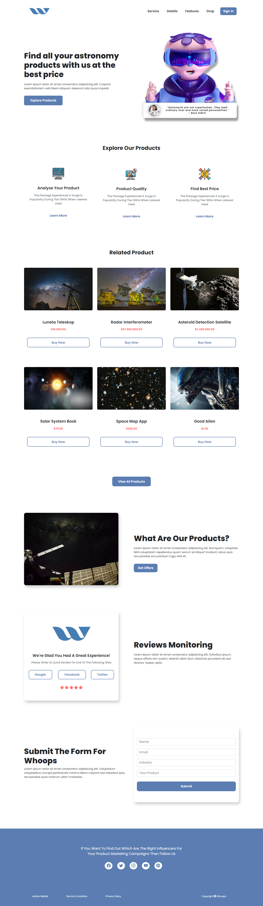

# Binar Learnings

Tempat untuk mengumpulkan latihan yang diberikan oleh mentor. Projek sederhana ini menggunakan Bootstrap versi 5.

Untuk lebih lengkapnya, baca dokumentasi link dibawah ini :

 - Bootstrap 5 `(https://getbootstrap.com/docs/5.1/getting-started/introduction/)`

## Responsive Design

Responsive web design atau desain web responsif adalah sebuah teknik atau metode bagi web designer untuk membuat suatu layout website yang dapat menyesuaikan diri sesuai dengan ukuran layar pengguna.

## Tampilan Desktop

Berikut gambaran ketika layar berukuran desktop (>= 1200px)

## Tampilan Mobile

Berikut gambaran ketika layar berukuran mobile (>= 576px )

