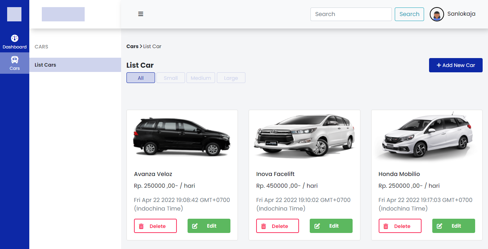

# Car Management Dashboard

Car Management Dashboard merupakan Challenge yang diberikan oleh pihak Binar Academy.

Untuk melengkapi kebutuhan pembuatan challenge bisa dilihat link di bawah ini :

- Bootstrap Versi 4.6 `https://getbootstrap.com/docs/4.6/getting-started/introduction/`
- Express.Js `https://expressjs.com/`
- Sequelize `https://sequelize.org/`
- Postgresql `https://www.postgresql.org/docs/`
- DBDiagram `https://dbdiagram.io/`

## Entity Relationship Diagram

Berikut Entity Relationship Diagram menggunakan (https://dbdiagram.io/)


## Endpoint REST API

Berikut endpoint REST API serta contoh request body dan response body:

- Pada postman atur method post dan isi url nya

**Contoh:**
```
{{base_url}}/add-car/create
```

- Setelah itu pilih body, klik radio button row lalu pilih format menjadi JSON:

**Contoh:**
```
{
    "name": "Honda Mobilio",
    "price": 250000,
    "size": "medium",
    "image": "https://resources.compressor-express.com/images/brands2/honda-mobilio.png"
}
```
- Dan terakhir klik send untuk create data, data dikembalikan dalam bentuk HTML.

## Lampiran 

Berikut lampiran yang bisa saya berikan sebagai gambaran challenge di chapter 5 ini.

### Postman

Postman merupakan sebuah aplikasi yang berfungsi sebagai REST CLIENT untuk uji coba REST API.

.png)

### PGAdmin

PGAdmin merupakan tool yang biasa digunakan untuk membuat database PostgreSQL.

.png)

### Localhost

Localhost merupakan virtual server yang biasa digunakan oleh para programmer atau developer.

